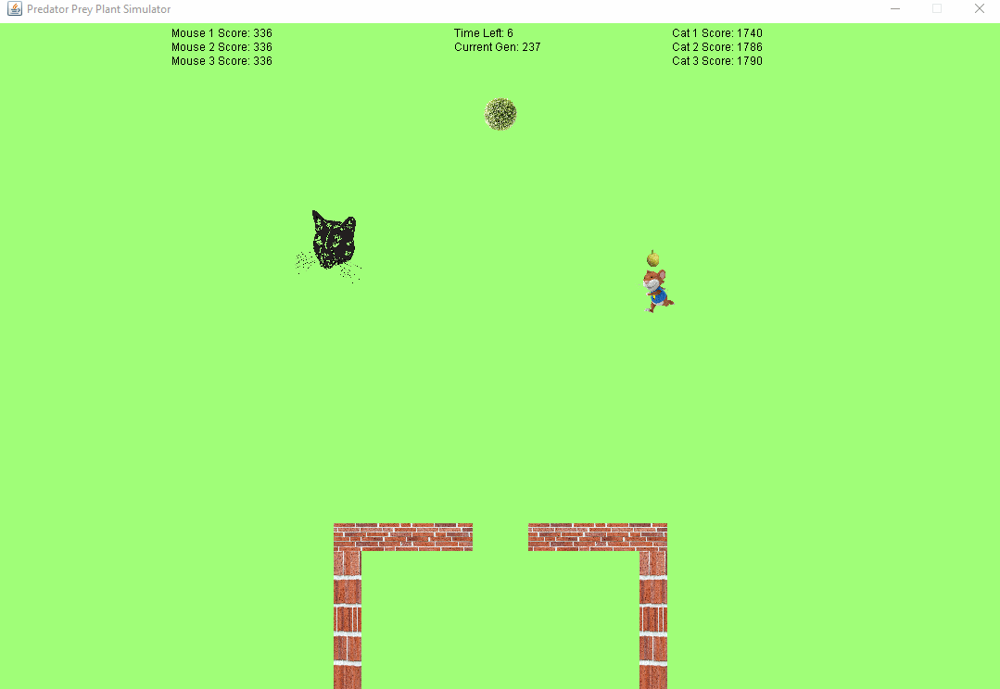
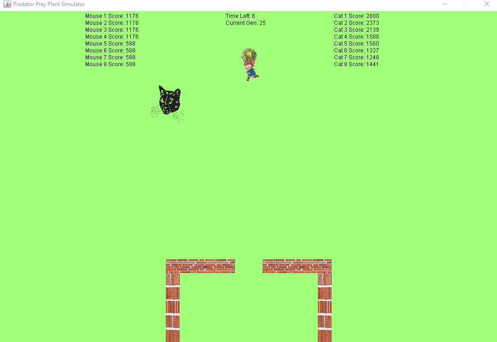
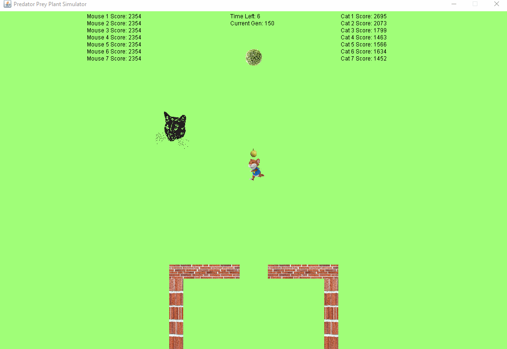
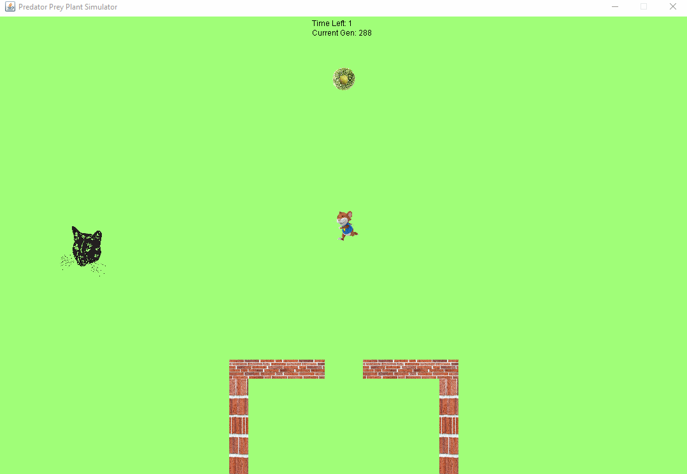
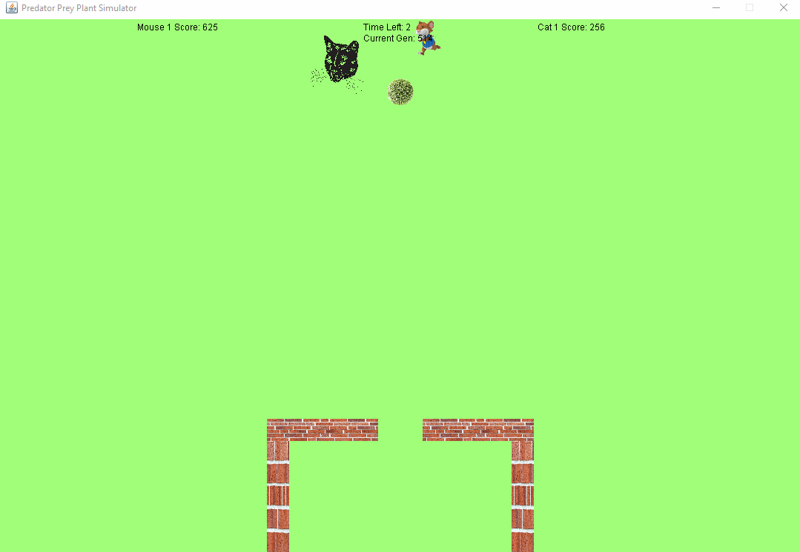
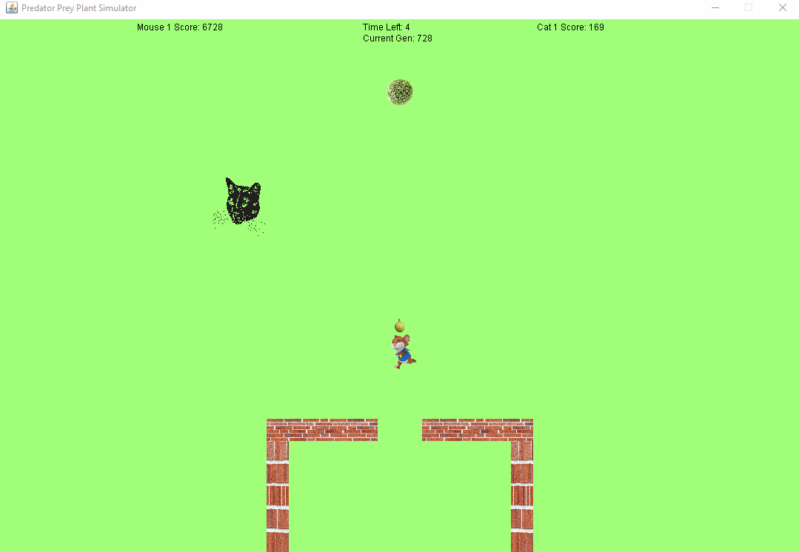

# Predator-Prey-Simulator

**Predator-Prey-Simulator** is a Java application that simulates a game of tag between two agents driven by a self-learning genetic algorithm.

## Goal
The goal of this simulation is to create a genetic algorithm and to utilize two instances of said genetic algorithm to synthesize a predator-prey relationship.

## Rules
The rules of the simulation are as follows. There are two agents, a predator and its prey, represented as a cat and a mouse respectively. There is a area at the base of the screen surrounded by a brick wall that the mouse may enter but the cat may not. This area can be referred to as the mouse den. There is a single object towards the top of the screen illustrated as a green bush holding a green fruit. The cat earns points for making contact with the mouse, which represents the predator eating its prey. The cat eating the mouse triggers the end of the round. Additionally the cat earns more points the faster it is able to consume the mouse to reward efficient behavior. The mouse earns points for making contact with the fruit as well as when the mouse brings the fruit back to the mouse den, which represents eating food and storing it for later use respectively. A time limit is set to limit each individual generation. Additionally the mouse is able to repel the cat for a brief moment sending it in the oposite direction from the mouse, and the cat is able to briefly stun the mouse, preventing the mouse from moving, referred to as "repelling" and "swatting" respectively.

## Changelog for Final Product

### Separate Agent Training
 - Certain # generations training before training target swap
 - 50 generations ideal
### Training Mode
 - Increases speed when enabled, now takes 1/10 time
### Implemented Gene Crossover
 - Crossover rate of 0.6
 - Previously each genes have 50% come from either parent
### Redesigned Action Calculation
 - State-based genetics
### Refined Gene Hyper-parameters
 - Increase population size 20-52
 - Decreased mutation rate 0.05-0.001
 - Roughly 6.552 mutations per generation
### Refined Fitness Test
 - Switch From Linear to Exponential Goal Step
 - Cat score influence from time now
 - Reduced chance of stuck
### Offset Cat
 - Reduces Mouses inclination to run into the cat

## Video Walkthroughs

Final Product of Proposal

Generation 237: Mouse Learns to dodge cat when training by itself

### Final Product
Generation 25: Mouse begins to understand grabbing fruit

Generation 150: Mouse and Cat develop simple techniques for achieving their goals

Generation 288: Cat learns to swat causing both agents' techniques to become janky

Generation 514: Mouse learns to repel causing both agents' techniques to become janky

Generation 728: Mouse refines repel technique, cat consistently loses

